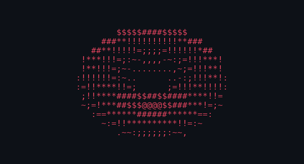

<!-- PROFILE README — boonyongyang -->

  
  

---

### About

- Mobile developer focused on Flutter, building cross-platform apps
- Full-stack: TypeScript, Next.js, Laravel
- Building agentic systems and automation pipelines
- Based in KL
- 📫 `boonyongyang@gmail.com`

---

### Projects

| Project | What it does |
|---|---|
| 🚁 [fpv-overlay-app](https://github.com/boonyongyang/fpv-overlay-app) | Flutter desktop: FPV footage and telemetry into finished overlay video |
| 🧱 [flutter_bloc_starter_kit](https://github.com/boonyongyang/flutter_bloc_starter_kit) | Production-ready Flutter BLoC architecture starter |
| 📱 [pocketfi](https://github.com/boonyongyang/pocketfi) | Mobile app, launched publicly |
| 🎞 [offline_movie_explorer](https://github.com/boonyongyang/offline_movie_explorer) | Offline-first Flutter movie explorer |

---

### Tech Stack

**Mobile & Frontend**

**Backend & Database**

**AI & Data**

---

### GitHub Stats

&nbsp;

 

 

---

### Contribution Snake

  

---

### Connect

  
  

<picture>
  <source media="(prefers-color-scheme: dark)" srcset="assets/donut-dark.gif">
  <source media="(prefers-color-scheme: light)" srcset="assets/donut-light.gif">
  
</picture>

 from <a href="https://github.com/boonyongyang">boonyongyang</a>

